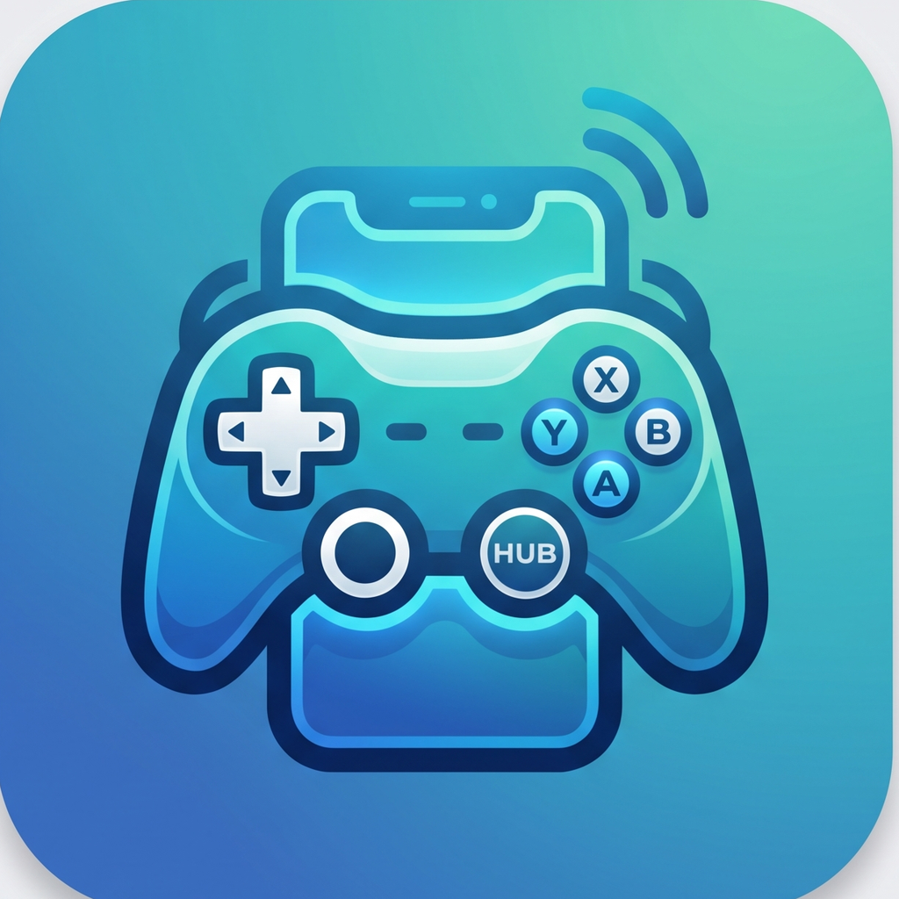

<p align="center">
  
</p>

<h1 align="center">ControllerHub</h1>

<p align="center">
  <strong>Turn your phone into a wireless game controller.</strong>
</p>

<p align="center">
  Use your phone as a controller for Windows games and applications over your local Wi-Fi network.
</p>

<p align="center">
  <a href="https://github.com/Anuragp2077/ControllerHub/releases/latest">
    
  </a>
  <a href="https://github.com/Anuragp2077/ControllerHub/blob/main/LICENSE">
    
  </a>
  
  
</p>

<p align="center">
  <a href="https://github.com/Anuragp2077/ControllerHub/releases/latest">Download</a>
  •
  <a href="https://github.com/Anuragp2077/ControllerHub/issues">Report a Bug</a>
  •
  <a href="https://github.com/Anuragp2077/ControllerHub/issues">Request a Feature</a>
</p>

---

## 🎮 What is ControllerHub?

**ControllerHub** turns your smartphone into a wireless game controller for Windows.

The phone communicates with the ControllerHub Windows application over a local Wi-Fi network using WebSockets.

ControllerHub receives the controller input, processes it through a generic controller abstraction, and exposes it to Windows as a virtual Xbox-compatible controller.

Multiple phones can connect simultaneously, with each phone receiving its own independent controller slot.

> **If you have a phone, you have a controller.**

---

## ✨ Features

### 📱 Mobile Controller

* Android controller application built with Flutter
* Landscape Xbox-style controller layout
* Analog left and right sticks
* Analog LT / RT triggers
* D-pad
* A / B / X / Y buttons
* LB / RB bumpers
* Start / Back controls
* Controller settings
* Independent axis inversion

### 🖥️ Windows Application

* Windows desktop dashboard built with WPF
* Local network controller server
* QR-code based pairing
* Connection and session management
* Up to **4 simultaneous controllers**
* Independent virtual controller slots
* Automatic connection timeout handling
* Controller heartbeat monitoring

### 🌐 Communication

* Local Wi-Fi communication
* WebSocket-based input transport
* Persistent client identities
* Token-based pairing
* Automatic reconnect handling
* Connection lifecycle management

### 🎮 Virtual Controller

ControllerHub converts phone input into a virtual Xbox-compatible controller using **ViGEmBus**.

Supported controller inputs:

| Input         | Support |
| ------------- | :-----: |
| A / B / X / Y |    ✅    |
| D-pad         |    ✅    |
| LB / RB       |    ✅    |
| LT / RT       |    ✅    |
| Start / Back  |    ✅    |
| Left Stick    |    ✅    |
| Right Stick   |    ✅    |
| L3 / R3       |    ✅    |
| Guide         |    ❌    |

---

## 🧩 How It Works

```text
┌─────────────────────┐
│      Android        │
│   Controller App    │
└──────────┬──────────┘
           │
           │ Local Wi-Fi
           │ WebSocket
           ▼
┌─────────────────────┐
│  ControllerHub      │
│  Windows Server     │
│                     │
│  • Pairing          │
│  • Sessions         │
│  • Input Routing    │
└──────────┬──────────┘
           │
           ▼
┌─────────────────────┐
│ ControllerHub.Core  │
│                     │
│ Controller State    │
│ Input Abstraction   │
└──────────┬──────────┘
           │
           ▼
┌─────────────────────┐
│      ViGEmBus       │
│                     │
│ Virtual Xbox        │
│ Controller          │
└──────────┬──────────┘
           │
           ▼
┌─────────────────────┐
│    Windows / Games  │
└─────────────────────┘
```

---

## 🏗️ Architecture

ControllerHub is divided into several components.

| Project                | Purpose                                                     |
| ---------------------- | ----------------------------------------------------------- |
| `ControllerHub.App`    | WPF Windows dashboard and application UI                    |
| `ControllerHub.Core`   | Generic controller state, inputs and abstractions           |
| `ControllerHub.Server` | WebSocket server, pairing, sessions and virtual controllers |
| `controllerhub_mobile` | Flutter mobile controller application                       |

### Windows

```text
ControllerHub.App
       │
       ▼
ControllerHub.Server
       │
       ▼
ControllerHub.Core
       │
       ▼
    ViGEmBus
```

### Mobile

```text
Flutter UI
    │
    ▼
Controller Input
    │
    ▼
WebSocket Client
    │
    ▼
ControllerHub Server
```

---

## 📸 Screenshots

Screenshots will be added to the repository as the project documentation grows.

### Windows Dashboard

<!-- Add screenshot here -->

<!-- Example:  -->

### Android Controller

<!-- Add screenshot here -->

<!-- Example:  -->

### QR Pairing

<!-- Add screenshot here -->

<!-- Example:  -->

---

## 🚀 Download

The latest version of ControllerHub is available from the GitHub Releases page.

### Windows

⬇️ **[Download ControllerHub for Windows](https://github.com/Anuragp2077/ControllerHub/releases/latest)**

The Windows release is distributed as a standalone installer.

The installer installs ControllerHub and the required virtual-controller driver.

### Android

📱 **Download ControllerHub for Android**

Download and install the Android APK on your phone.

---

## 💻 Requirements

### Windows

* Windows 10 or Windows 11
* x64 Windows PC
* Local Wi-Fi network
* ViGEmBus virtual controller driver

### Android

* Android device
* Android 6.0 or newer
* Wi-Fi connectivity
* Same local network as the Windows PC

---

## ⚡ Quick Start

### Windows

1. Download the latest ControllerHub installer from **[Releases](https://github.com/Anuragp2077/ControllerHub/releases/latest)**.
2. Run the installer.
3. Complete the installation.
4. Launch ControllerHub.
5. Start the controller server.
6. Generate a pairing QR code.

### Android

1. Download the latest ControllerHub APK.
2. Install the application.
3. Open ControllerHub.
4. Choose the QR scanning option.
5. Scan the QR code shown on the PC.
6. Wait for the controller connection.

### Connect Your Phone

Make sure the Windows PC and Android phone are connected to the **same local network**.

Once connected:

```text
Phone
  ↓
Wi-Fi
  ↓
ControllerHub
  ↓
Virtual Xbox Controller
  ↓
Windows Game
```

---

## 🔗 QR Pairing

ControllerHub uses QR-based pairing to simplify connecting phones to the Windows application.

The QR code contains:

```text
Server Address
      +
Server Port
      +
Temporary Pairing Token
```

The pairing token is temporary and is used to authenticate the initial controller connection.

A pairing session can be used by multiple phones until the available controller slots are filled.

---

## 👥 Multiple Controllers

ControllerHub supports up to **four simultaneous controllers**.

```text
Phone 1 ──► Controller 1
Phone 2 ──► Controller 2
Phone 3 ──► Controller 3
Phone 4 ──► Controller 4
```

Each connected phone receives an independent virtual controller slot.

This makes ControllerHub suitable for local multiplayer scenarios where multiple players need controllers.

---

## 🎛️ Controller Settings

The Android controller includes configurable analog-stick settings.

Independent inversion is available for:

* Left Stick X
* Left Stick Y
* Right Stick X
* Right Stick Y

This allows players to customize the controller to their preferred control scheme.

---

## 🛡️ Connection Safety

ControllerHub continuously monitors connected clients using heartbeat messages.

If a controller stops communicating for a defined period, its session is automatically terminated and the controller slot is released.

This helps prevent stuck inputs when:

* A phone loses Wi-Fi
* The application is closed unexpectedly
* The phone goes offline
* The network connection is interrupted

---

## 🧑‍💻 Technology

### Windows

* C#
* .NET
* WPF
* WebSockets
* ViGEmBus
* QRCoder

### Android

* Flutter
* Dart
* WebSockets
* Mobile Scanner
* Shared Preferences
* UUID

---

## 📁 Project Structure

```text
ControllerHub/
│
├── .github/
│   ├── ISSUE_TEMPLATE/
│   └── workflows/
│
├── assets/
│   └── branding/
│
├── docs/
│   └── screenshots/
│
├── installer/
│   └── ControllerHub.iss
│
├── ControllerHub.App/
│   └── Windows WPF application
│
├── ControllerHub.Core/
│   └── Generic controller abstractions
│
├── ControllerHub.Server/
│   └── Networking and virtual controller backend
│
├── controllerhub_mobile/
│   └── Flutter mobile application
│
├── .gitignore
├── LICENSE
├── README.md
└── ControllerHub.slnx
```

---

## 🗺️ Roadmap

### V1.0.0

* [x] Windows desktop application
* [x] Android controller
* [x] QR-code pairing
* [x] WebSocket communication
* [x] Up to 4 simultaneous controllers
* [x] Virtual Xbox-compatible controllers
* [x] Analog sticks
* [x] Analog triggers
* [x] D-pad
* [x] Face buttons
* [x] Bumpers
* [x] Controller settings
* [x] Axis inversion
* [x] Heartbeat monitoring
* [x] Connection timeout handling
* [x] Windows installer

### Future

* [ ] iOS controller application
* [ ] Controller profiles
* [ ] Button remapping
* [ ] Custom controller layouts
* [ ] Stick sensitivity
* [ ] Deadzone configuration
* [ ] Motion controls
* [ ] Haptic feedback
* [ ] Automatic PC discovery
* [ ] Additional virtual-controller backends
* [ ] More customization options

---

## ⚠️ Known Limitations

The current release focuses on:

* Windows
* Android
* Local Wi-Fi networks
* Xbox-compatible virtual controllers

Internet-based remote controller connections are **not supported**.

ControllerHub is designed for use on trusted local networks.

---

## 🤝 Contributing

Contributions, ideas and bug reports are welcome.

Before contributing:

1. Check existing issues.
2. Open an issue for major feature proposals.
3. Keep pull requests focused on a specific change.
4. Include relevant testing information.

---

## 🐛 Bug Reports

Found a problem?

**[Open a Bug Report](https://github.com/Anuragp2077/ControllerHub/issues)**

Please include:

* ControllerHub version
* Windows version
* Android version
* Phone model
* Steps to reproduce
* Expected behavior
* Actual behavior
* Relevant logs or screenshots

---

## 💡 Feature Requests

Have an idea for ControllerHub?

**[Request a Feature](https://github.com/Anuragp2077/ControllerHub/issues)**

Ideas around controller customization, connectivity, multiplayer, performance, haptics, motion controls and device discovery are welcome.

---

## 📄 License

ControllerHub is open source and distributed under the terms of the license included in this repository.

See **[LICENSE](LICENSE)** for details.

---

## ⭐ Support the Project

If ControllerHub is useful to you, consider giving the project a ⭐ on GitHub.

It helps the project gain visibility and supports continued development.

---

<p align="center">
  <strong>ControllerHub</strong>
  <br>
  Turn your phone into a controller.
</p>

<p align="center">
  Made with ❤️ using C#, .NET, WPF, Flutter and WebSockets.
</p>
